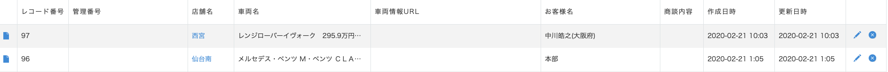
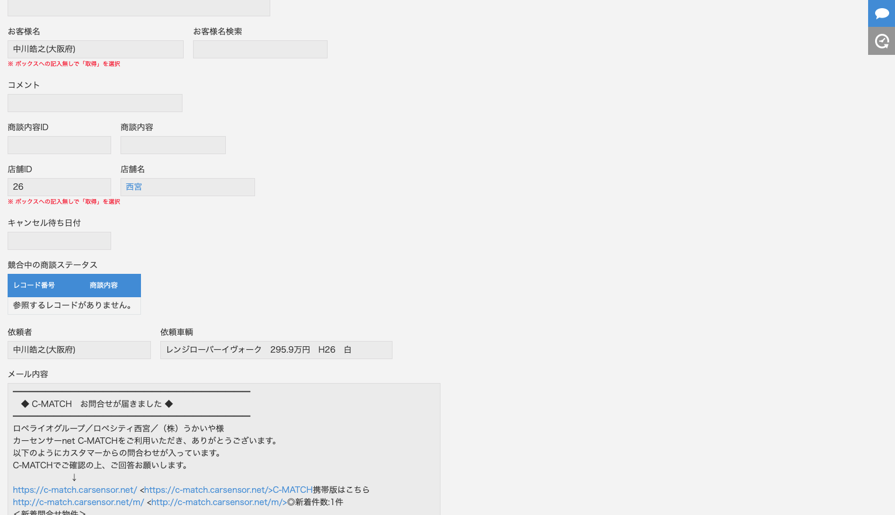

# loperaio kintone
## 商談メールから情報を抽出し、kintoneアプリに自動登録
### 目次
- 概要
- どんな感じで登録されるのか？？
- フローの各段階の設定についての説明
- 商談ステータス−`確認用`から本番用への移行の仕方
- 送信されてくるメールの店舗名と登録されている店舗名が異なる事への対応の仕方
- `lambda_function.py`の具体的なコードの説明
- `AWS Lambda`へのアップロード
<br>
<br>

### 概要
- `test@x-point-1.org`にフォーマットに沿ったメールを送ると、登録される。
- 送られてきた商談メールから「店舗名」「車両名」「お客様名」「メール本文」を取得し、<br>Kintoneの「商談ステータス−`確認用`」に登録する。

- 送られてくる`商談メールは2種類`あり、「グーネット」と「カーセンサー」。

- ざっくりとした流れ(フロー)は、<br>`メール送信` → `SES` → `S3` → `Lambda` → `Kintoneアプリ`

<br>
<br>

### どんな感じで登録されるのか？？
「お客様名」は「依頼者」フィールドにも登録されるようにしてある。<br>
「車両名」は「依頼車輌」フィールドにも登録されるようにしてある。<br>
「店舗名」は、正規表現とPythonの`OrderedDict`を使って取り出し、登録している。<br>
※「店舗名」の登録に関しては、調整が必要な部分があるため、後ほど改めて説明する。
#### まずはこんな感じ...
レコード一覧画面

レコード詳細画面


#### メールの各フォーマットと、情報の該当箇所


「グーネット」の場合、<br>
- 「店舗名」は「ロペライオグループ　ロペシティセントラルスクエア店／（株）ロペライオ　御中」の部分<br>
- 「お客様名」は「■お客様情報」の「お名前：」の部分<br>
- 「車両名」は「■車両情報」の「依頼車輌：」の部分<br>
から取り出している。<br>

```
■■■━━━━━━━━━━━━━━━━━━━━━━━
グーネット中古車見積りサービス ご回答依頼のお知らせ
━━━━━━━━━━━━━━━━━━━━━━━━■■■
■問合せ番号： UC2019122906021919
■問合せ方法： パソコン
■車庫証明：
■納車情報：
■下取車情報：
■見積・問合せ情報
依頼種別： 見積り
■車輌情報
依頼車輌： メルセデス・ベンツ Ｍ・ベンツ ＣＬＡ１８０　ＡＭＧスタイル　ＡＭＧプレミアムＰＫＧ　禁煙
年式： 2018年
走行距離： 1.1万K
価格： 285.9万円
カラー： ポーラーホワイト
管理番号：
■お客様情報
お名前： 本部
住所： 埼玉県戸田市
年代：
性別：
購入予定時期：
希望時間帯：
ロペライオグループ　ロペシティセントラルスクエア店／（株）ロペライオ　御中
いつもお世話になっております。
グーネットお客様センターです。
グーネット中古車等で貴社の掲載車両をご覧になったお客様より
見積り・問合せ依頼がございましたのでご案内します。
下記アドレスからMOTORGATEを開き、
上記問合せ番号のお客様へのご回答処理をお願い致します。
正式回答の自動回答設定をしている車輌につきましては、
追加連絡にて、質問に対する回答をお願い致します。
http://motorgate.jp/
※問合せ依頼に対するご回答は、お客様がお待ちですので、
ご依頼後48時間以内の処理をお願い致します。
！▲このメールに対する返信は受付致しかねます▲！
_______________________________________________________
(株)プロトコーポレーション　PROTO CORPORATION
 ◇PROTOサポートセンター
 │TEL：050-3786-4400
 │mail：customer_c@goo-net.com
_______________________________________________________
```

「カーセンサー」の場合、<br>
- 「店舗名」は「ロペライオグループ　ロペシティセントラルスクエア店／（株）ロペライオ　御中」の部分<br>
- 「お客様名」は「■お客様情報」の「お名前：」の部分<br>
- 「車両名」は「＜新着問い合わせ物件＞」の「【】」の中の部分<br>
から取り出している。<br>

```
━━━━━━━━━━━━━━━━━━━━━━━━━━━━━
　◆ C-MATCH　お問合せが届きました ◆
━━━━━━━━━━━━━━━━━━━━━━━━━━━━━
ロペライオグループ／ロペシティ西宮／（株）うかいや様
カーセンサーnet C-MATCHをご利用いただき、ありがとうございます。
以下のようにカスタマーからの問合わせが入っています。
C-MATCHでご確認の上、ご回答お願いします。
　　　　　　　↓
https://c-match.carsensor.net/
C-MATCH携帯版はこちら
http://c-match.carsensor.net/m/
◎新着件数:1件
＜新着問合せ物件＞
https://www.carsensor.net/cgi-bin/CS/CSif3.cgi?CMDCD=1&BKKN=VU2720011124&SHOP=316066014U
【レンジローバーイヴォーク　295.9万円　H26　白】
■依頼者　　: 中川皓之(大阪府)
■依頼種別　: 【見】
■内容詳細　:
■カーセンサーからの追加情報■性別：不明　年代：不明
-----------------------------------
＊＊＊＊＊＊＊＊＊＊＊＊＊＊＊＊＊＊＊＊＊＊＊＊
　カーセンサー お客様サポートセンター
　　営業時間　（平日）　10:00～20:00
　　　　　　　（土日祝）10:00～18:00
　TEL 0120-757-839（または096-311-5544）
　FAX 096-311-5590
　Mailto:support@carsensor.net
　　株式会社リクルートマーケティングパートナーズ
＊＊＊＊＊＊＊＊＊＊＊＊＊＊＊＊＊＊＊＊＊＊＊＊
```

<br>
<br>

### フローの各段階の設定についての説明
ざっくりとした流れ(フロー)は、<br>
`メール送信` → `SES` → `S3` → `Lambda` → `Kintoneアプリ`

#### ●`メール送信` → `SES`の部分の設定

- SESの`region`は`us-east-1` (米国東部(バージニア北部))

- ドメイン登録で`x-point-1.org`が設定されている。

- `Rule set`は`loperaio-rule-set`を使用。

- `Rule`は`put-loperaio-email`を使用。

- 保存先のS3バケットは`loperaio-email`を指定。

- `Rule`の`Recipient`は設定していないため、<br>
現在では認証済みの全てのドメイン宛に来たメールを保存する感じになっている。<br>
本番では、ここにロペライオのドメインを指定する。

#### ●`SES` → `S3`の部分の設定
- S3バケット`loperaio-email`にメールが保存されるように設定している。

#### ●`S3` → `Lambda`の部分の設定
-  `Lambda`の`region`は`us-east-1`(米国東部(バージニア北部))

- Lambda関数は`loperaio-S3mail2kintone`を使用。

- `トリガー`は`loperaio-email`の`ObjectCreated`

#### ●`Lambda` → `Kintoneアプリ`の部分の設定
- `実行ロール`はS3のFullAccessがついている`kintone_email`を使用。

- `環境変数`はだいたいは見てわかっていただける気がしますが、

- `環境変数`の`KINTONE_APP`は、現在は「商談ステータス-確認用」のアプリ番号。

- `環境変数`の`KINTONE_API_KEY`は、現在は「商談ステータス-確認用」のアプリのapi-key。

- `環境変数`の`KINTONE_PASSWORD`と`KINTONE_USER`は、<br>
ルックアップ(店舗名)を登録するために、パスワード認証が必要だったため設定している。
- `body4loperaio.json`に抽出したデータを入れていき、ポストすることでレコードを登録する。
- ここで``大事な注意点``であるが、まず、前提として、<br>
ルックアップフィールドから自動入力されるフィールドに、値をポストすることはできない。
- そのため、「お客様名」「車両名」を入力するためには、<br>
「お客様名検索」(ルックアップ)の値入力先を「ユーザーネーム＿」(文字列)として一旦退避させ、<br>
その後、jsを使って「お客様名」にコピーして登録させることによって、<br>
APIをつかって「お客様名」に値をポストできるようにしている。「車両名」も同様である。<br>
(本番環境では、「車両名」のコピーフィールドが無いためその作成が必要である。jsファイルは確認用アプリのものを使えば良い)


<br>
<br>

### 商談ステータス−`確認用`から本番用への移行の仕方
各フローの説明のところをみて、SES,S3,Lambda,Kintoneの設定等を見てください。
#### ●SES
- loperaioのドメインを追加、認証。

- `Recipient`にloperaioのドメインを指定。

#### ●S3
- 特になし。

#### ●Lambda
- `環境変数`の`KINTONE_APP`を本番用のアプリの番号に設定。

- `環境変数`の`KINTONE_API_KEY`を本番用のアプリのapi-keyに変更。

#### ●Kintone
- 確認用のアプリについている`order.js`を、本番用のアプリについてるorder.jsと付け替える。

- 基本的に、`確認用の設定を本番用にちゃんとコピーすれば良いです。`

- 本番用アプリに、「車両名コピー」「依頼者」「依頼車輌」「メール内容」フィールドを作成。<br>
(フィールドコードはbody4loperaio.jsonを参照)
- 「車両名コピー」のフィールドコードは、`car_name_copy`。
- 「依頼者」のフィールドコードは`requester`。

- 「依頼車輌」のフィールドコードは`requested_car`。

- 「メール本文」のフィールドコードは`email_body`。

- `重要！`本番用アプリの、車両名ルックアップのコピー先を「車両名」から「車両名コピー」へと変更。

<br>
<br>

### 送信されてくるメールの店舗名と登録されている店舗名が異なる事への対応の仕方
`lambda_function.py`の`get_shop_name`関数の`shopDic`を見てください。
```python
shopDic = OrderedDict((
        (".*浦和美園.*","浦和美園"),
        (".*大阪中央.*","大阪中央"),
        (".*柏.*","柏"),
        (".*港北.*","港北"),
        (".*郡山.*","郡山"),
        (".*さいたま.*","さいたま"),
        (".*仙台南.*","仙台南"),
        (".*台場.*","台場"),
        (".*西宮.*","西宮"),
        (".*セントラルスクエア.*","セントラルスクエア"),
        (".*練馬.*","練馬"),
        (".*名古屋北.*","名古屋北"),
        (".*江戸川.*","江戸川"),
        (".*札幌平岸.*","札幌平岸"),
        (".*世田谷.*","世田谷"),
    ))
```
辞書型となっているため、`.*hogehoge.*`がメール本文から取得したデータで、keyとなります。<br>
そして、それに対応した　valueが店舗名として返される関数となっているため、`.*hogehoge.*`に一致した店舗名を`gehogeho`にしたい場合は、`(".*hogehoge.*","gehogeho")`としてください。<br>
※ここのコードの編集はもしかしたら私しかできないかもしれない(Lambdaのデプロイパッケージが大きすぎてインライン編集ができない)ので、対応が必要な際は教えて下さい。
<br>
<br>
### `lambda_function.py`の具体的なコードの説明
`lambda_function.py`はAWSのLambda上で実際に実行されるファイルです。<br>
そして、このファイルの中の、`lambda_handler`が実際の実行される関数です。<br>
そしてこのファイルに関係しているものとして、`body4loperaio.json`があります。

`lambda_function.py` には実際に役割を果たす関数として
- `lambda_handler`

- `get_shop_name`

- `RecordPost2kintone`

の３つがあります。<br>
`get_shop_name`に関しては、目次でいうところの「送信されてくるメールの店舗名と登録されている店舗名が異なる事への対応の仕方」で説明できていると思うので、割愛します。

#### ●`RecordPost2kintone`関数の説明
この関数は、実際のKintoneにデータをポストするためのデータをつくる役割を果たしています。
```
def RecordPost2kintone(url, headers, post_record_dic):
```
このように宣言されているので、`url`,`headers`,`post-record_dic`が必要になります。<br>
そのうち、`url`,`headers`をファイルの冒頭部分で作成しています。
(`os.environ["hogehoge"]`はLambda上で設定した環境変数を取得しています。)
```python
#Lambdaに保存した環境変数を取得
KINTONE_URL = "https://{kintone_domain}/k/v1/record.json"
url = KINTONE_URL.format(
   kintone_domain=os.environ["KINTONE_DOMAIN"],
   kintone_app=os.environ["KINTONE_APP"]
)
headers_key = os.environ["KINTONE_HEADERS_KEY"]
api_key = os.environ["KINTONE_API_KEY"]
headers = {headers_key: api_key}
headers["Content-Type"] = "application/json"

user = os.environ["KINTONE_USER"]
password = os.environ["KINTONE_PASSWORD"]
user_and_password = base64.b64encode("{}:{}".format(user,password).encode('utf-8'))
headers["X-Cybozu-Authorization"] = user_and_password.decode('utf-8')
```
この部分の辞書型の`headers`のKeyとして、`X-Cybozu-Authorization`がありますが、これは、ルックアップフィールドを登録するためにKintoneのログイン認証が必要だからです。


そして、`url`,`headers`以外の残りの`post_record_dic`を`lambda_handler`で作っていく。という風になります。

#### ●`lambda_handler`関数の説明
まずやっている事としては、「メールの情報の抽出」です。<br>
46行目から87行目あたりの間で、S3に作成されたメールから、メールのボディ、添付ファイル名とそのデータが取り出されており、
90行目から104行目あたりでは、実際に`body4loperaio.json`に沿った形式の辞書型変数`body_post_dic`にデータを入れています。<br>

```python
body_post_dic["app"] = os.environ["KINTONE_APP"]
  if "グーネット" in body:
      body_post_dic["record"]["shop_name"]["value"]        = get_shop_name(body.split("<html><head><meta http-equiv=")[0].split("希望時間帯")[1].split("御中")[0])
      body_post_dic["record"]["requester"]["value"]        = body.split("<html><head><meta http-equiv=")[0].split("お名前： ")[1].split("住所")[0]
      body_post_dic["record"]["requested_car"]["value"]    = body.split("<html><head><meta http-equiv=")[0].split("依頼車輌： ")[1].split("年式")[0]
      body_post_dic["record"]["car_name"]["value"]         = body.split("<html><head><meta http-equiv=")[0].split("依頼車輌： ")[1].split("年式")[0]
      body_post_dic["record"]["user_name"]["value"]        = body.split("<html><head><meta http-equiv=")[0].split("お名前： ")[1].split("住所")[0]
  elif "カーセンサー" in body:
      body_post_dic["record"]["shop_name"]["value"]        = get_shop_name(body.split("<html><head><meta http-equiv=")[0].split("ロペライオグループ／")[1].split("／")[0])
      body_post_dic["record"]["requester"]["value"]        = body.split("<html><head><meta http-equiv=")[0].split("依頼者　　: ")[1].split("\n")[0]
      body_post_dic["record"]["requested_car"]["value"]    = body.split("<html><head><meta http-equiv=")[0].split("【")[1].split("】")[0]
      body_post_dic["record"]["user_name"]["value"]        = body.split("<html><head><meta http-equiv=")[0].split("依頼者　　: ")[1].split("\n")[0]
      body_post_dic["record"]["car_name"]["value"]         = body.split("<html><head><meta http-equiv=")[0].split("【")[1].split("】")[0]

  body_post_dic["record"]["email_body"]["value"]           = body.split("<html><head><meta http-equiv=")[0]
```

特定のデータの取り出し方については、`メールの各フォーマットと、情報の該当箇所`を参照ください。<br>
そして最後に`RecordPost2kintone`関数に渡しています。

<br>
<br>

### `AWS　Lambdaへのアップロード`
アップロードファイルが大きすぎるため、zip形式で圧縮して、アップロードする必要があります。<br>またそれに伴い、Lambda上でインライン編集ができません。<br>
フォルダ内に移動し、
`zip -r zip_file ./*`を実行して、できたzipファイルをアップロードしてください。
